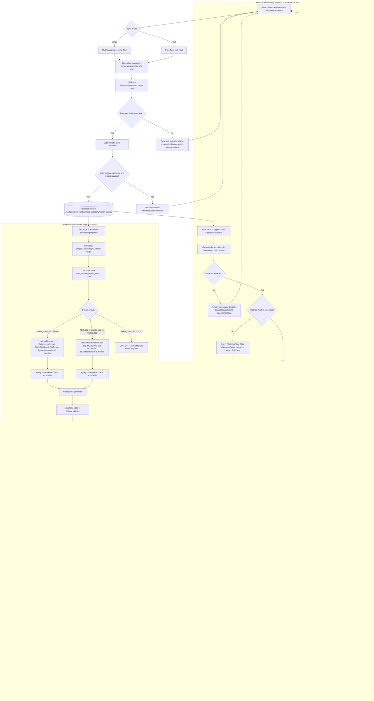

# AI System Design Flowchart  
## Hyper-Local Business Advisory & Financial Structuring Assistant

The following flowchart reflects the required build order, strict separation between deterministic calculations and LLM-generated content, real-data provenance, multilingual interaction, and the composite advisory decision.



## Core data contract

```json
{
  "request": {
    "location_raw": "Silchar, Assam",
    "business_category": "dairy",
    "margin_capital": 100000,
    "language": "en"
  },
  "financial": {
    "project_cost": 1000000,
    "loan_amount": 900000,
    "scheme": "Term Loan Scheme",
    "interest_rate_annual": 0.08,
    "tenure_years": 7,
    "moratorium_months": 6,
    "quarterly_installment": 0,
    "total_interest_paid": 0,
    "total_repayment": 0,
    "moratorium_policy": "interest_paid_separately",
    "manual_review_required": false
  },
  "market": {
    "competitor_count": 0,
    "competitor_density": 0,
    "nearby_examples": [],
    "population_proxy": null,
    "data_sources": [
      {
        "source": "OSM Overpass",
        "retrieved_at": "2025-01-01T00:00:00Z"
      }
    ]
  },
  "feasibility": {
    "signal": "unknown",
    "criteria": [],
    "data_sufficient": false
  },
  "narrative": {
    "swot": [],
    "claims": [],
    "is_ai_generated": true
  },
  "advisory": {
    "affordability_threshold": 0,
    "affordable": false,
    "outcome_tier": "Not recommended, alternative suggested"
  }
}
```

## Deterministic financial calculation

```python
def calculate_financial_plan(margin_capital: float) -> dict:
    if margin_capital <= 0:
        raise ValueError("margin_capital must be greater than zero")

    project_cost = margin_capital / 0.10
    base_loan_amount = project_cost * 0.90

    if project_cost <= 140_000:
        scheme = "Micro Finance Scheme"
        max_loan_pct = 0.90
        loan_cap = 125_000
        annual_rate = 0.065
        tenure_years = 3
        moratorium_months = 3

    elif project_cost <= 5_000_000:
        scheme = "Term Loan Scheme"
        max_loan_pct = 0.90
        loan_cap = 4_500_000
        annual_rate = 0.08
        tenure_years = 7
        moratorium_months = 6

    else:
        return {
            "project_cost": project_cost,
            "loan_amount": base_loan_amount,
            "scheme": "OUT_OF_RANGE",
            "manual_review_required": True
        }

    loan_amount = min(base_loan_amount, loan_cap)

    quarterly_rate = annual_rate / 4
    moratorium_qtrs = moratorium_months / 3
    repayment_qtrs = (tenure_years * 4) - moratorium_qtrs

    quarterly_installment = (
        loan_amount
        * quarterly_rate
        * (1 + quarterly_rate) ** repayment_qtrs
        / ((1 + quarterly_rate) ** repayment_qtrs - 1)
    )

    moratorium_interest = loan_amount * quarterly_rate * moratorium_qtrs
    repayment_principal_and_interest = quarterly_installment * repayment_qtrs

    # Explicit product assumption:
    # interest accrued during moratorium is paid separately.
    total_repayment = repayment_principal_and_interest + moratorium_interest
    total_interest_paid = total_repayment - loan_amount

    return {
        "project_cost": project_cost,
        "loan_amount": loan_amount,
        "scheme": scheme,
        "interest_rate_annual": annual_rate,
        "tenure_years": tenure_years,
        "moratorium_months": moratorium_months,
        "quarterly_installment": quarterly_installment,
        "total_interest_paid": total_interest_paid,
        "total_repayment": total_repayment,
        "moratorium_policy": "interest_paid_separately",
        "manual_review_required": False
    }
```

## Required boundary tests

```python
def test_standard_term_loan_case():
    result = calculate_financial_plan(100_000)

    assert result["project_cost"] == 1_000_000
    assert result["loan_amount"] == 900_000
    assert result["scheme"] == "Term Loan Scheme"
    assert result["interest_rate_annual"] == 0.08
    assert result["tenure_years"] == 7
    assert result["moratorium_months"] == 6

def test_micro_finance_boundary():
    # margin capital = project cost × 10%
    result = calculate_financial_plan(14_000)

    assert result["project_cost"] == 140_000
    assert result["scheme"] == "Micro Finance Scheme"

def test_small_micro_finance_case():
    result = calculate_financial_plan(12_000)

    assert result["project_cost"] == 120_000
    assert result["scheme"] == "Micro Finance Scheme"

def test_out_of_range_case():
    result = calculate_financial_plan(600_000)

    assert result["project_cost"] == 6_000_000
    assert result["scheme"] == "OUT_OF_RANGE"
    assert result["manual_review_required"] is True
```

## Important implementation policies

### 1. LLM responsibilities

The LLM may:

- Extract structured intent.
- Ask targeted questions for missing fields.
- Generate narrative explanations.
- Produce SWOT and opportunity statements.
- Explain deterministic results in the user’s language.
- Convert retrieved evidence into cited narrative claims.

The LLM must not:

- Calculate project cost, loan amount, interest, EMI, totals, or thresholds.
- Guess a missing margin amount.
- Invent competitor counts or population values.
- Select a scheme independently.
- Create uncited local market claims.
- Override deterministic validation results.

### 2. Feasibility policy

The feasibility signal should be implemented as a transparent, configurable rule rather than hidden in the LLM.

For example:

```python
def calculate_feasibility_signal(
    competitor_density: float | None,
    population_proxy: float | None,
    data_sufficient: bool
) -> dict:
    if not data_sufficient:
        return {
            "signal": "unknown",
            "data_sufficient": False,
            "reason": "Insufficient verified local data"
        }

    # Product assumptions must be configurable and displayed.
    low_competition = competitor_density <= 5
    adequate_population = (
        population_proxy is None or population_proxy >= 10_000
    )

    feasible = low_competition and adequate_population

    return {
        "signal": "feasible" if feasible else "not_feasible",
        "data_sufficient": True,
        "criteria": {
            "competitor_density_threshold": 5,
            "population_threshold": 10_000
        }
    }
```

These thresholds are product assumptions, not government facts. They should appear in configuration and optionally in the report.

### 3. Affordability policy

Because the available input is margin capital rather than household income or expected business cash flow, affordability must be labeled as a screening proxy.

A transparent initial assumption could be:

```python
affordability_threshold = margin_capital * 0.25
affordable = quarterly_installment <= affordability_threshold
```

This should be presented as:

> “Affordability screening proxy: quarterly repayment is compared with 25% of declared margin capital. This is not a substitute for lender underwriting or verified business cash-flow analysis.”

For a real product, replace this with projected monthly or quarterly free cash flow.

### 4. Grounded narrative format

The SWOT model should return structured claims such as:

```json
{
  "claims": [
    {
      "type": "strength",
      "claim": "The proposed location has limited identified competition within the search radius.",
      "based_on": ["competitor_count", "competitor_density"],
      "inference_flag": false
    },
    {
      "type": "opportunity",
      "claim": "A nearby institutional customer segment may provide an initial market opportunity.",
      "based_on": ["location_raw"],
      "inference_flag": true,
      "note": "This requires local validation because no direct demand data was retrieved."
    }
  ]
}
```

Every specific numerical or local claim must reference a field from the market-data response.

## Recommended API interaction flow

```text
POST /api/intent/extract
        |
        v
POST /api/financial/structure
        |
        v
GET /api/location/geocode
        |
        v
GET /api/market/competitors
        |
        v
GET /api/market/population-proxy
        |
        v
POST /api/feasibility/evaluate
        |
        v
POST /api/narrative/swot
        |
        v
POST /api/advisory/compose
        |
        v
POST /api/voice/synthesize   [optional]
```

## Suggested UI hierarchy

1. **Outcome tier**
   - Feasible & affordable
   - Feasible, financing tight
   - Eligible — scale down advised
   - Not recommended, alternative suggested

2. **Verified financial plan**
   - Project cost
   - Loan amount
   - Scheme
   - Quarterly installment
   - Total repayment
   - Interest and moratorium assumptions

3. **Local market evidence**
   - Competitor count
   - Competitor density
   - Nearby examples
   - Population proxy
   - Retrieved timestamps and sources

4. **AI-generated advisory narrative**
   - SWOT
   - Opportunities
   - Risks
   - Claims linked to evidence
   - Explicit inference labels

5. **Warnings**
   - Government scheme details require verification.
   - Market data may be incomplete.
   - Financial output is an eligibility-planning estimate, not a loan approval.
   - High-value or out-of-range requests require manual review.

## Build sequence

```text
Phase 1 → Financial engine and tests
Phase 2 → Geocoding, competitors, population data, and caching
Phase 3 → Structured multilingual intent extraction
Phase 4 → Grounded SWOT and opportunity generation
Phase 5 → Composite tier and report presentation
Phase 6 → STT/TTS wrapper and multilingual end-to-end testing
```

This architecture keeps all financial and factual outputs auditable while allowing the LLM to provide useful multilingual explanations without becoming a source of fabricated numbers or unsupported local claims.